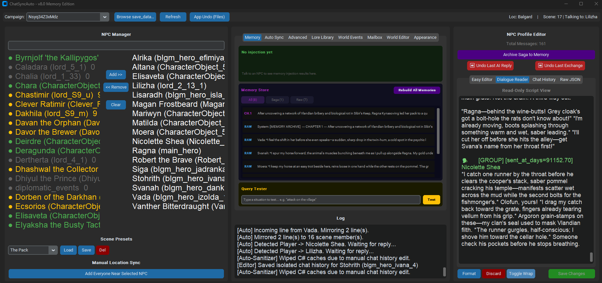
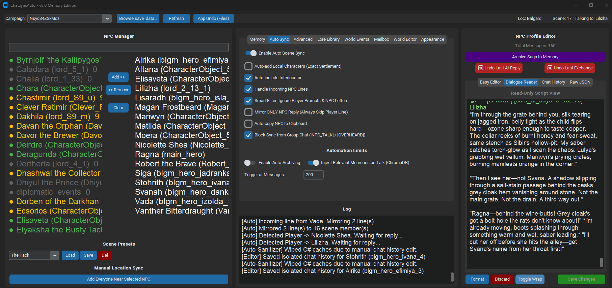

# ChatSyncAuto — v8.0 Memory Edition

A desktop companion for the **AI Influence** mod in **Mount & Blade II: Bannerlord**.

The AI Influence mod gives your NPCs AI-driven dialogue. ChatSyncAuto sits on top of it and handles everything the mod itself doesn't — **shared scene awareness, long-term semantic memory, auto-archived sagas, a mailbox, and a full world editor.**

Built in Python with CustomTkinter, watchdog, and ChromaDB. Fully local — memory and embeddings never leave your machine.

<p align="center">
  
  
</p>

---

## What it does

- **NPCs remember you across campaigns.** Every conversation turn becomes a memory. When you walk up to an NPC, the app detects the talk-click and injects the top 3 most relevant memories into that NPC's character description before they reply — so they actually remember who you are, what you did last time, and what matters to them.
- **Nearby NPCs hear what you say.** When you talk to someone, every other NPC in the same scene sees the conversation too. The world feels aware instead of full of isolated dialogue bubbles.
- **Long histories become lore.** When a chat history gets too long, ChatSyncAuto compresses the old messages into a third-person chapter via an LLM, saves it to your Lore Library, and indexes it into the NPC's memory bank. The active context stays fast; the narrative never gets lost.
- **Letters get their own inbox.** `[LETTER]` and `[MESSENGER]` events are filtered out of normal dialogue and archived with real-world timestamps.
- **A full world editor.** Edit global events, diplomatic statements, kingdom rules, action rules, or raw JSON with live validation and multi-level undo.

---

## Screenshots

**Memory Tab** — browse what any NPC remembers. Health dots (● green: 10+ memories, ● yellow: 1–9, ● gray: none), per-chunk browser with Saga / Raw filter, and a query tester that shows which memories would surface for a given situation.


**Auto Sync Tab** — the mirror engine. Scene sync toggles, dialogue filters, the Inject Relevant Memories on Talk switch, and a live file-change log.


---

## Features

### Memory Bank *(new in v8.0)*
- **ChromaDB-backed semantic memory** with built-in MiniLM embeddings — fully local, no cloud calls.
- **Talk-click detection**: when you walk up to an NPC, their top 3 relevant memories are injected into the character description automatically.
- **Health dots** on every NPC in the list so you can see at a glance who has memories indexed.
- **Chunk browser**: expand any memory chunk, filter by Saga chapter or Raw turn, see exactly what the retriever is pulling.
- **Query tester**: type a situation, see which memories would surface (top-5).
- **Injection strip**: the last talk-click's NPC, query, and injected chunks displayed at the top of the Memory tab.
- **Rebuild All Memories**: one button re-indexes chapters and raw turns for your entire roster.
- **Mass-injection guard**: 5-second cooldown prevents injection bursts when the game loads multiple NPCs at once.

### Scene Sync
- Real-time JSON file monitoring via `watchdog`
- Mirrors new lines to every other NPC in the same scene
- Settlement-ID grouping auto-adds companions sharing a location
- SHA1 deduplication prevents echo loops
- Smart filter skips OOC prompts `(continue)`, letters, and (optional) group chat `[NPC_TALK]` / `[OVERHEARD]` noise
- `[OVERHEARD]` auto-scene: parses overhear tags and adds physically present NPCs to the scene
- Pending-lost recovery and 30-second stale-pending expiry keep mirroring reliable across mid-conversation refreshes

### NPC Profile Editor
| Tab | Contents |
|-----|----------|
| Easy Editor | Personality, backstory, speech quirks, known info, secrets |
| Dialogue Reader | Formatted transcript view |
| Chat History | Direct editor for the conversation array |
| Raw JSON | Full file view with live syntax validation |

All tabs: live validation, multi-level undo.

### AI Saga Archiver
- Summarizes old conversation history into compact `MEMORY ARCHIVE` entries
- Each summary saved as a numbered chapter in the Lore Library
- Chapters auto-index into the Memory Bank the moment they're written
- Backends: **Ollama** (local), OpenAI, Groq, OpenRouter, Anthropic

### Mailbox
- Detects `[LETTER]` / `[MESSENGER]` events via regex
- Pulls them out of the mirror flow and archives per-NPC
- Can retroactively scan saves to recover old letters

### World Events Vault
- Watches the mod's global event and diplomatic-statement JSONs
- Auto-vaults events
- Optional AI summarization into a **World Chronicle** lore chapter

### World Editor
- Direct editors for `world.txt`, action rules, event generator rules, kingdom statement rules
- JSON validation + save / undo

### Scene Management
- Two-panel NPC manager (add / remove / search)
- Scene presets — save and load named NPC groups
- Location-based auto-grouping by Settlement ID
- Auto-include the current interlocutor

### Quality of Life
- Auto-copy NPC lines to clipboard for pasting into the game
- Configurable reply-wait timers and timeout
- Appearance theming (dark, light, system)
- C# mod cache clearing (Quick Rewind)

---

## Setup

1. Install dependencies:
   ```bash
   pip install customtkinter watchdog chromadb
   ```

2. Run the app:
   ```bash
   python ChatSyncAuto.py
   ```

3. Point it at your AI Influence mod's `save_data` folder. Steam and Game Pass install locations are auto-detected.

4. *(Optional)* Add an LLM API key in settings if you want the Saga Archiver to generate chapter summaries.

---

## Requirements

- **Python 3.10+**
- **Mount & Blade II: Bannerlord** with the **AI Influence** mod installed
- `customtkinter`, `watchdog` *(required)*
- `chromadb` *(required for Memory Bank — highly recommended)*
- LLM API key *(optional, Saga Archiver only)* — supports Ollama, OpenAI, Groq, OpenRouter, Anthropic

---

## What's new in v8.0 Memory Edition

- **Memory Bank** with ChromaDB semantic retrieval
- **Memory tab** with chunk browser, query tester, injection strip
- **Talk-click memory injection** — top-3 relevant memories added to NPC context automatically
- **Health dots** on the NPC list
- **Auto-index on archive** — new saga chapters indexed immediately, no manual step
- **Mass-injection guard** — prevents injection bursts when scenes load
- **Async chunk browser** — UI stays responsive at thousands of chunks
- **`[OVERHEARD]` auto-scene** — automatically adds nearby NPCs who heard you
- **Ignore Group Chat** toggle — filter `[NPC_TALK]` / `[OVERHEARD]` out of mirror flow
- **Stale-pending + pending-lost recovery** — robust mirroring across mid-conversation refreshes

---

## License

GPLv3 — see [LICENSE](LICENSE)
